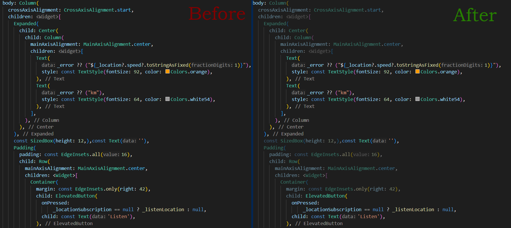

# Flutter Highlighter

Improve Flutter code clarity by auto-dimming less important widgets.

## Before vs After

## Commands

| Command | Description |
| --- | --- |
| `flutter-highlighter.highlight` | Highlights important widgets in the current file. |

##  Widgets

> Currently supporting only a handfull of layout widgets. More coming soon.

See full list [here](./src/widgets.js).

## Settings

| Command | Type | Default | Example | Description |
| --- | --- | --- | --- | --- |
| `flutter-highlighter.highlightOnFocus` | `boolean` | `true` | | Should it automatically highlight the focused widget? |
| `flutter-highlighter.opacity` | `number` | `0.5` | | The opacity of the faded widgets. Must be between `0 - 0.99`. |
| `flutter-highlighter.excludedWidgets` | `array` | `[]` | `'Padding'` | List of widgets to keep visible.  |
| `flutter-highlighter.includedWidgets` | `map` | `{}` | `{ "ScrollPage": { "propertyName": "child" } }` | Extra widgets you want to fade. Make the map's key the name of the widget and set the property name that you want to be highlighted. By default it supports `child` and `children`, but it can be anything.**In case of multi-values** (like the children is), you also need to set the `"wrapper": "[]"`.  |

## Updates
- `v0.1.0`
    - Had a major rewrite to support optionaly empty (no children) widgets.
Both `Container(width: 250, child: ... )` and `Container(height: 250)` are valid widgets.
    - Added fade for the whole widget, not just until the property.
        - Ex. `Container(width: 250, child: ..., padding: ... )` now both *width* and *padding* are dimmed.
    - Bundle size reduced from `22MB` to `980KB`.

## Feedback

If you have any feedback, please reach out to me in the [Issues section](https://github.com/dozsolti/flutter-highlighter/issues).

## License

[MIT](https://choosealicense.com/licenses/mit/)

